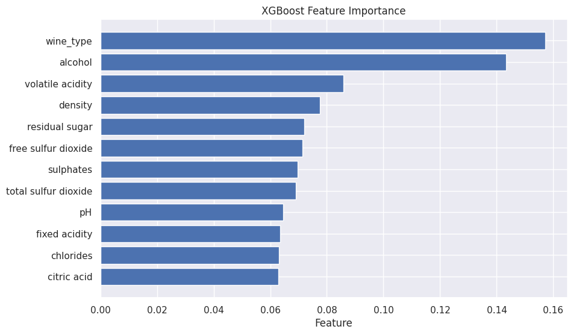

# Predicting Wine Quality with Machine Learning

### Project Overview
**Authors:** Chris Coker, Isaac Graham, Kate Kollman

**Course:** STAT 335

This project applies machine learning techniques to predict the quality of Portuguese "Vinho Verde" wines based on physicochemical properties. By comparing linear baseline models against nonlinear gradient boosting methods, we aimed to identify the most significant chemical drivers of wine quality.

---

### Hypotheses & Objectives
Based on our initial research, we tested the following hypotheses:
1.  **Alcohol Content:** We hypothesized that alcohol content is the primary positive driver of wine quality.
2.  **Model Performance:** We hypothesized that nonlinear models (XGBoost) would significantly outperform linear models (Logistic Regression) due to complex interactions between chemical attributes.

---

### Data Description
* **Source:** [UCI Machine Learning Repository - Wine Quality Dataset](https://archive.ics.uci.edu/dataset/186/wine+quality).
* **Sample Size:** 6,497 observations (merged Red and White wine datasets).
* **Features:** 11 continuous physicochemical variables (e.g., acidity, sugar, chlorides, pH, sulphates) and 1 binary variable for wine type.
* **Target (Y):** Expert-assigned quality score (Ordinal scale 0–10).
* **Preprocessing:** Datasets were merged, measurement errors removed, and a binary 'wine_type' variable was added.

---

### Methodology & Model Training
We employed a Train-Validation-Test split strategy to ensure generalizability. We trained and tuned three distinct model classes:

1.  **Multinomial Logistic Regression (Baseline):** Serves as a linear baseline for interpretation.
2.  **Ridge Logistic Regression (L2 Regularization):** Tuned via the `C` parameter (Best C=1.0) to handle multicollinearity.
3.  **XGBoost (Gradient Boosting):** An advanced ensemble method used to capture nonlinear relationships and interaction effects.

---

### Model Comparison & Evaluation
We evaluated models using **Accuracy**, **Weighted F1-Score**, and **Log Loss**.

| Model | Accuracy | Weighted F1 | Test Log Loss |
| :--- | :--- | :--- | :--- |
| **Baseline Logistic Regression** | ~54% | 0.51 | 1.08 |
| **Ridge Logistic Regression** | ~54% | 0.51 | 1.07 |
| **XGBoost (Final Model)** | **~68%** | **0.67** | **0.85** |

#### Key Findings:
* **XGBoost Superiority:** The XGBoost model outperformed the logistic baseline by **14% in accuracy**, confirming our hypothesis that nonlinear relationships are critical for predicting wine quality.
* **Feature Importance:** While alcohol was a top predictor, the XGBoost model identified **'wine_type'** as the most significant feature, followed by alcohol and volatile acidity.
* **Class Imbalance:** All models struggled with rare quality scores (3, 4, 8, 9), but XGBoost showed improved recall for the minority classes compared to linear models.

*Figure 1: XGBoost Feature Importance Plot *

---

### Conclusion & Future Work
Our analysis confirmed that nonlinear models better capture the complex chemical interactions that drive perceived wine quality[cite: 470]. While high alcohol content is strongly correlated with quality, it is not the sole driver; factors like wine type and volatile acidity play massive roles.

**Limitations:** The dataset lacks extreme quality values (very few 3s or 9s), making it difficult to predict outliers.

**Future Work:** We recommend incorporating SHAP value analysis to better interpret the specific impact of interactions and expanding the dataset to include wines from diverse geographic regions.

---

### 📂 Files Included
* `notebooks/Wine_Quality_Analysis.ipynb`: Complete Python code for EDA, cleaning, and modeling.
* `reports/335 Final Presentation (1).pdf`: Executive summary slide deck.
* `reports/STAT 335 Project Proposal.pdf`: Original hypothesis and project plan.
